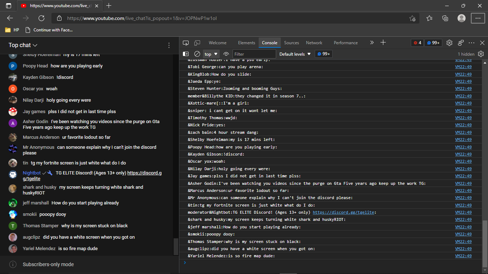
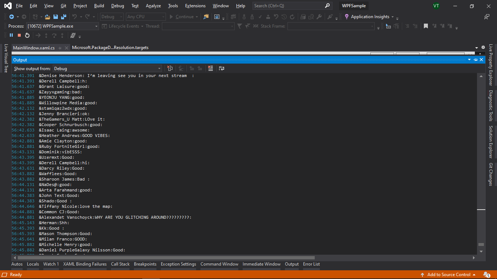

# YoutubeLive-Chat-Extract

    popout the live chat (https://www.youtube.com/live_chat?{}) from a youtube live video and use the script to extract the chat details, tested on webviews and browser consoles 

<h3>On Browser Console</h3>

 </img>

<h3>VS Debug View From using Web2View @https://github.com/MicrosoftEdge/WebView2Browser</h3>

 </img>

